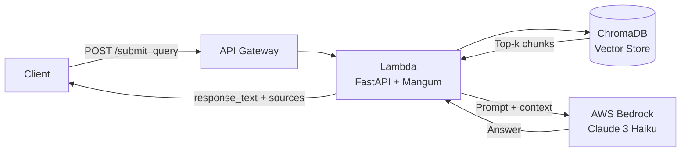

# serverless-rag-api

A production-ready Retrieval-Augmented Generation (RAG) API deployed on **AWS Lambda** via Docker. Accepts natural-language queries against your PDF knowledge base and returns grounded answers with source citations.

---


```
User Query → API Gateway → Lambda → ChromaDB (vector search) → Bedrock (Claude) → Response + Sources
```



---

## Stack

| Layer | Technology |
|---|---|
| API | FastAPI + Mangum |
| Vector DB | ChromaDB (L2 similarity) |
| LLM | AWS Bedrock — Claude 3 Haiku |
| Embeddings | AWS Bedrock Embeddings |
| Runtime | AWS Lambda (Docker image) |

---

## Prerequisites

- Docker
- AWS account with Bedrock access enabled (`us-east-1`)
- AWS credentials with `bedrock:InvokeModel` permission

---

## Setup

**1. Configure environment**

```bash
cp docker_image/.env.example docker_image/.env
# Fill in AWS_ACCESS_KEY_ID, AWS_SECRET_ACCESS_KEY, API_KEY
```

**2. Add your PDFs**

```
docker_image/src/data/source/   ← place PDF files here
```

**3. Populate the vector database**

```bash
cd docker_image
pip install -r requirements.txt
python populate_database.py

# To rebuild from scratch:
python populate_database.py --reset
```

**4. Build and run locally**

```bash
docker build -t rag-api ./docker_image
docker run -p 8000:8000 --env-file docker_image/.env rag-api
```

---

## API

### Health check

```
GET http://localhost:8000/
```

### Submit a query

```bash
curl -X POST http://localhost:8000/submit_query \
  -H "Content-Type: application/json" \
  -H "x-api-key: YOUR_API_KEY" \
  -d '{"query_text": "How do I contact support?"}'
```

**Response**

```json
{
  "query_text": "How do I contact support?",
  "response_text": "You can reach support at ...",
  "sources": ["src/data/source/manual.pdf:3:1"]
}
```

---

## Environment Variables

| Variable | Description |
|---|---|
| `AWS_ACCESS_KEY_ID` | AWS credentials |
| `AWS_SECRET_ACCESS_KEY` | AWS credentials |
| `AWS_DEFAULT_REGION` | AWS region (default: `us-east-1`) |
| `API_KEY` | Bearer token for the API (optional — skipped if unset) |
| `CORS_ORIGINS` | Comma-separated allowed origins (default: `*`) |

---

## Deploy to AWS Lambda

1. Push the Docker image to **Amazon ECR**
2. Create a Lambda function from the ECR image
3. Set the handler to `app_api_handler.handler`
4. Attach an **API Gateway** trigger
5. Set environment variables in the Lambda console
