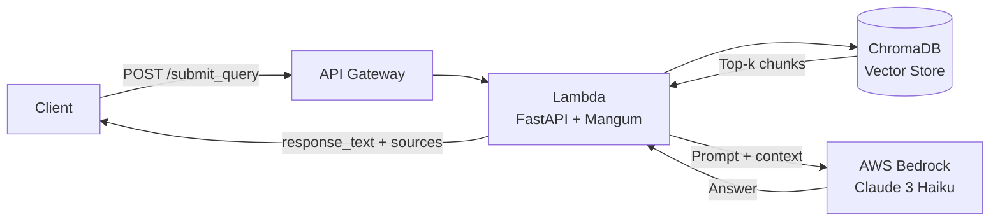

# serverless-rag-api

 production-ready Retrieval-Augmented Generation (RAG) stack with a **serverless API** and a **React frontend**. The backend runs on **AWS Lambda** (Docker + FastAPI + Mangum) behind **API Gateway**, indexing your PDF knowledge base into **ChromaDB** and using **AWS Bedrock (Claude 3 Haiku + Bedrock embeddings)** to return grounded answers with source citations. The frontend is a modern React chat-style UI that lets users submit natural-language queries, view streamed answers, and inspect the underlying source documents.

---

## Features

- **Serverless RAG API**
  - FastAPI app wrapped with Mangum and deployed to AWS Lambda via Docker image.
  - Uses ChromaDB (L2 similarity) as a vector store over your PDF documents.
  - Queries AWS Bedrock (`anthropic.claude-3-haiku-20240307-v1:0`) with deterministic settings (`temperature=0`) for grounded answers.

- **PDF‑based knowledge base**
  - Simple ingestion pipeline: drop PDFs into `docker_image/src/data/source/` and run `populate_database.py`.
  - Rebuilds the vector store from scratch with a `--reset` flag.

- **Source citations and document serving**
  - Each answer returns a list of `sources` (document identifiers) that were used to answer the query.
  - Dedicated `GET /documents/{filename}` endpoint serves the original PDFs so users can verify cited sources.

- **React chat frontend**
  - Single-page React app with a chat-style interface (“ZEPP Knowledge Engine”).
  - Lets users submit queries, view responses, and see which sources were used.
  - Communicates with the backend `POST /submit_query` endpoint and links to `GET /documents/{filename}` for opening PDFs.

- **Production-friendly concerns**
  - Optional API key protection via `API_KEY` environment variable (skipped if unset).
  - Configurable CORS via `CORS_ORIGINS`.
  - Uses a module-level Bedrock client and ChromaDB connection to take advantage of warm Lambda executions.

```
User Query → API Gateway → Lambda → ChromaDB (vector search) → Bedrock (Claude) → Response + Sources
```



---

## Stack

| Layer | Technology |
|---|---|
| API | FastAPI + Mangum |
| Vector DB | ChromaDB (L2 similarity) |
| LLM | AWS Bedrock — Claude 3 Haiku |
| Embeddings | AWS Bedrock Embeddings |
| Runtime | AWS Lambda (Docker image) |

---

## Prerequisites

- Docker
- AWS account with Bedrock access enabled (`us-east-1`)
- AWS credentials with `bedrock:InvokeModel` permission

---

## Setup

**1. Configure environment**

```bash
cp docker_image/.env.example docker_image/.env
# Fill in AWS_ACCESS_KEY_ID, AWS_SECRET_ACCESS_KEY, API_KEY
```

**2. Add your PDFs**

```
docker_image/src/data/source/   ← place PDF files here
```

**3. Populate the vector database**

```bash
cd docker_image
pip install -r requirements.txt
python populate_database.py

# To rebuild from scratch locally:
python populate_database.py --reset
```

**4. Build and run locally**

```bash
docker build -t rag-api ./docker_image
docker run -p 8000:8000 --env-file docker_image/.env rag-api
```

---

## API

### Health check

```http
GET /
```

## Response

{
  "status": "healthy",
  "service": "rag-api"
}

---

## Environment Variables

| Variable | Description |
|---|---|
| `AWS_ACCESS_KEY_ID` | AWS credentials |
| `AWS_SECRET_ACCESS_KEY` | AWS credentials |
| `AWS_DEFAULT_REGION` | AWS region (default: `us-east-1`) |
| `API_KEY` | Bearer token for the API (optional — skipped if unset) |
| `CORS_ORIGINS` | Comma-separated allowed origins (default: `*`) |

---

## Deploy to AWS Lambda

1. Push the Docker image to **Amazon ECR**
2. Create a Lambda function from the ECR image
3. Set the handler to `app_api_handler.handler`
4. Attach an **API Gateway** trigger
5. Set environment variables in the Lambda console
